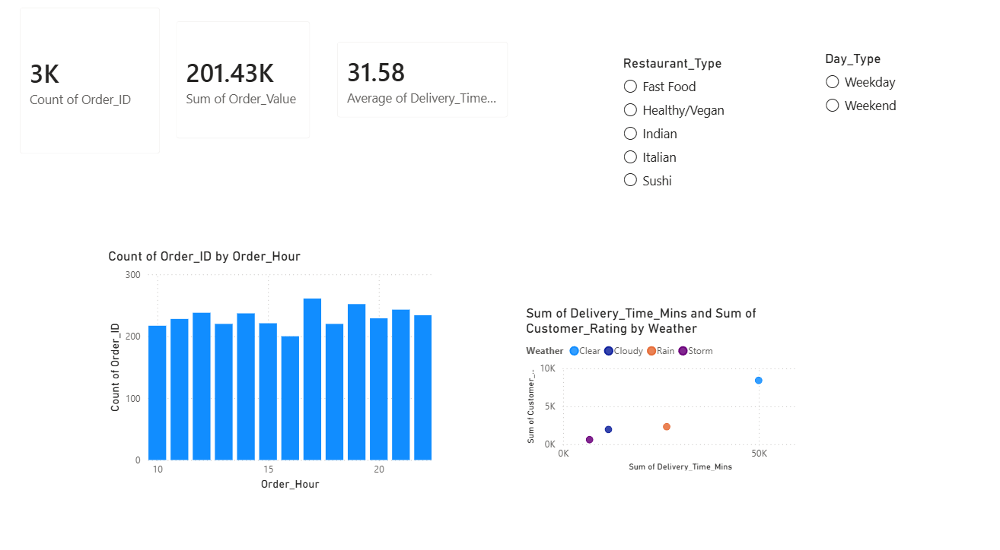

# 📈 Marketing Funnel & Ad Spend ROI Dashboard


A cross-platform marketing analytics dashboard connecting top-of-funnel metrics (impressions, clicks) to bottom-line results (revenue, ROI) — built to help marketing teams find where budget is working hardest, and where it's being wasted.

---

## 📑 Table of Contents

- [Project Overview](#-project-overview)
- [Business Questions Answered](#-business-questions-answered)
- [Data Pipeline & Methodology](#%EF%B8%8F-data-pipeline--methodology)
- [Visual Insights](#-visual-insights)
- [Key Findings](#-key-findings)
- [Project Structure](#-project-structure)
- [Author](#-author)

---

## 🚀 Project Overview

Marketing teams generate data across many channels but often struggle to connect top-of-funnel metrics like impressions to bottom-line revenue impact. This project synthesizes cross-platform advertising data — Google Ads, Meta, TikTok, LinkedIn, and Email — into a single diagnostic dashboard, allowing stakeholders to calculate exact Return on Ad Spend (ROAS) by platform and optimize future budget allocation.

---

## 🎯 Business Questions Answered

| # | Question | Why it matters |
|---|---|---|
| 1 | **Campaign Performance** — Which campaigns drive the most purchases and revenue? | Shows which creative/messaging is actually converting |
| 2 | **Platform Efficiency & ROI** — What's the ROI for each advertising dollar spent by platform? | Directs future budget toward the highest-return channels |
| 3 | **Funnel Conversion** — Where do users drop off (Impressions → Clicks → Leads → Purchases)? | Identifies the exact stage losing the most potential customers |

---

## ⚙️ Data Pipeline & Methodology

<details>
<summary><strong>1. Funnel Analytics (Python & Pandas)</strong></summary>
<br>

- Processed raw advertising logs using Python (`marketing_campaign_analysis.py`) to engineer conversion-rate metrics.
- Calculated Click-Through Rate (CTR) and purchase conversion percentages to locate funnel drop-off points.
</details>

<details>
<summary><strong>2. Profitability Aggregation (SQL)</strong></summary>
<br>

- Aggregated ad spend and revenue to isolate the most profitable campaigns.
- Established baseline ROI benchmarks across channels prior to visualization.
</details>

<details>
<summary><strong>3. Visual Engineering (Power BI)</strong></summary>
<br>

- Built a multi-variable chart showing the funnel decay from impressions to purchases.
- Engineered DAX measures to track campaign-level ROI through dedicated visuals.
- Built a scatter plot correlating ad spend with revenue to spot high-efficiency platforms at a glance.
</details>

---

## 📊 Visual Insights

**Marketing Funnel Overview**
*Step-by-step conversion decay and platform-level spend/revenue comparison.*



**Campaign ROI Analysis**
*Isolating the highest-ROI campaigns vs. underperforming ad spend.*


---

## 🔍 Key Findings

- **Total ROI: 10.56%** across **$3.78M in ad spend**, generating **$43.68M in revenue**.
- **Email Promo delivered the highest ROI** of any platform — despite having the smallest ad spend, beating Google Ads, TikTok, Meta, and LinkedIn.
- **Google Ads and Meta drove the highest impression and click volume**, but didn't convert that scale into the best ROI — a sign of diminishing returns at high spend levels.
- **LinkedIn Ads had the lowest revenue output** relative to its spend, making it the weakest-performing channel in this dataset.

---

## 📁 Project Structure

```
├── Data/
│   └── marketing_campaign_data.csv          # Raw marketing dataset
├── Python_Scripts/
│   └── marketing_campaign_analysis.py       # CTR and ROAS calculation logic
├── Dashboard/
│   └── marketing_campaign_data.pbix         # Power BI project file
├── Media/
│   ├── dashboard_overview.png               # Dashboard screenshot
│   └── campaign_roi_analysis.png            # Dashboard screenshot
└── README.md
```

---

## 👨‍💻 Author

**Nizam Ud Din**
B.S. Computer Science — University of Turbat

Data Analyst building hands-on experience with Excel, SQL, Python, and Power BI through real end-to-end projects.

📧 balochnizam410@gmail.com · 🔗 [Portfolio](https://nizam001-ui.github.io/data-analyst-portfolio/)
